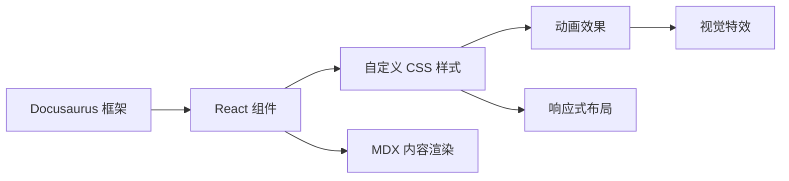

## 1. Architecture Design
这是一个基于 Docusaurus 2 的静态博客网站，通过自定义主题和样式来实现出色的视觉效果。



## 2. Technology Description
- **前端框架**: Docusaurus 2.0.0-alpha.69 (基于 React 16)
- **样式方案**: 自定义 CSS + Infima 框架扩展
- **动画方案**: CSS 关键帧动画 + 过渡效果
- **内容格式**: Markdown / MDX
- **构建工具**: Webpack (Docusaurus 内置)

## 3. File Structure
```
/workspace/
├── src/
│   ├── css/
│   │   └── custom.css          # 自定义主题样式
│   └── theme/                 # 自定义主题组件 (将创建)
├── docusaurus.config.js       # Docusaurus 配置
└── package.json               # 项目依赖
```

## 4. Key Implementation Points
### 4.1 自定义样式系统
- 重写 Infima CSS 变量以实现独特的配色方案
- 添加全局动画和过渡效果
- 实现响应式布局和断点设计

### 4.2 主题定制
- 利用 Docusaurus 的主题替换机制
- 自定义导航栏、页脚、博客列表等组件样式
- 添加视觉特效和动画

### 4.3 性能优化
- 使用 CSS 动画而非 JavaScript 动画
- 优化图片加载和显示
- 确保流畅的滚动体验

## 5. Customization Strategy
1. **全局样式**: 在 `src/css/custom.css` 中定义
2. **主题配置**: 修改 `docusaurus.config.js` 中的 `themeConfig`
3. **字体加载**: 使用 Google Fonts CDN 加载优雅字体
4. **视觉特效**: 通过 CSS 渐变、阴影、动画实现
