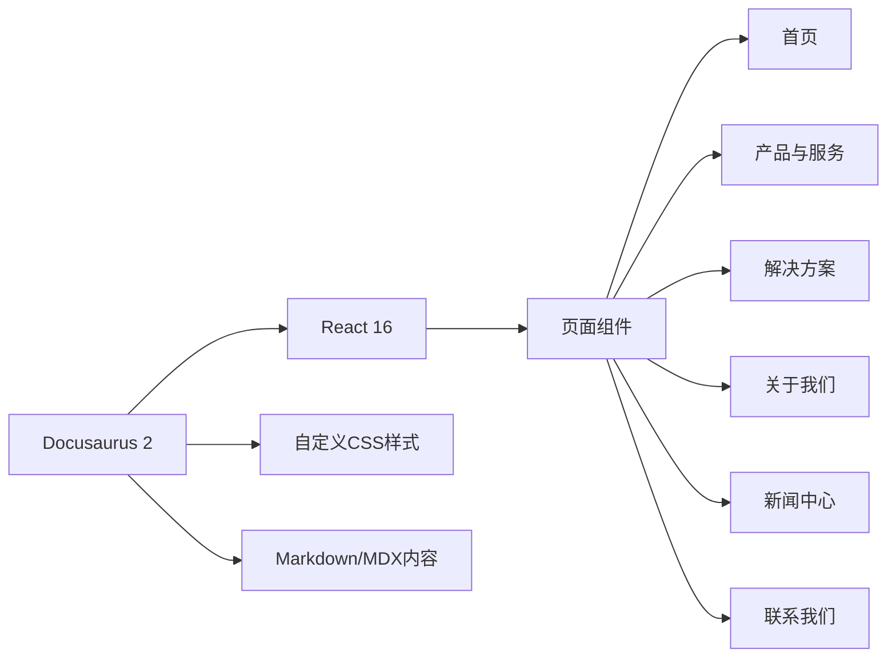

# 签梦云（济南）信息科技有限公司官网 - 技术架构文档

## 1. Architecture Design
本项目基于现有Docusaurus 2框架进行改造，将个人博客转变为企业官网。



## 2. Technology Description
- **前端框架**：Docusaurus 2.0.0-alpha.69 (基于 React 16)
- **样式方案**：自定义CSS + Infima框架扩展
- **动画方案**：CSS关键帧动画 + 过渡效果
- **内容格式**：Markdown/MDX
- **构建工具**：Webpack (Docusaurus内置)

## 3. Route Definitions
| Route | Purpose |
|-------|---------|
| / | 首页 - 公司形象展示 |
| /products | 产品与服务 |
| /solutions | 行业解决方案 |
| /about | 关于我们 |
| /news | 新闻中心 |
| /contact | 联系我们 |

## 4. File Structure
```
/workspace/
├── blog/                      # 新闻内容
│   ├── 2019-05-28-hola.md
│   ├── 2019-05-29-hello-world.md
│   └── 2019-05-30-welcome.md
├── docs/                      # 产品和文档
│   └── doc1.md
│   └── doc2.md
│   └── doc3.md
│   └── mdx.md
├── src/
│   ├── css/
│   │   └── custom.css      # 自定义主题样式
│   └── pages/             # 自定义页面组件
│       ├── index.js
│       └── styles.module.css
├── static/                # 静态资源
│   └── img/
│       ├── favicon.ico
│       ├── logo.svg
│       └── ...
├── docusaurus.config.js  # Docusaurus配置
└── package.json
```

## 5. Key Implementation Points
### 5.1 自定义页面结构
1. 首页 - 改造hero区域、产品展示、核心优势、客户案例
2. 产品与服务 - 产品列表、功能介绍
3. 解决方案 - 行业方案展示
4. 关于我们 - 公司介绍、发展历程
5. 新闻中心 - 新闻列表、详情页
6. 联系我们 - 联系方式、咨询表单

### 5.2 样式系统改造
1. 工业科技配色方案
2. 工业风格UI组件
3. 响应式布局
4. 交互动画效果

### 5.3 导航配置
1. 更新公司信息配置
2. 导航菜单配置
3. 页面路由配置
4. 页脚信息配置

### 5.4 性能优化
1. 图片优化和懒加载
2. CSS动画优化
3. 页面预加载
4. 响应式图片加载
