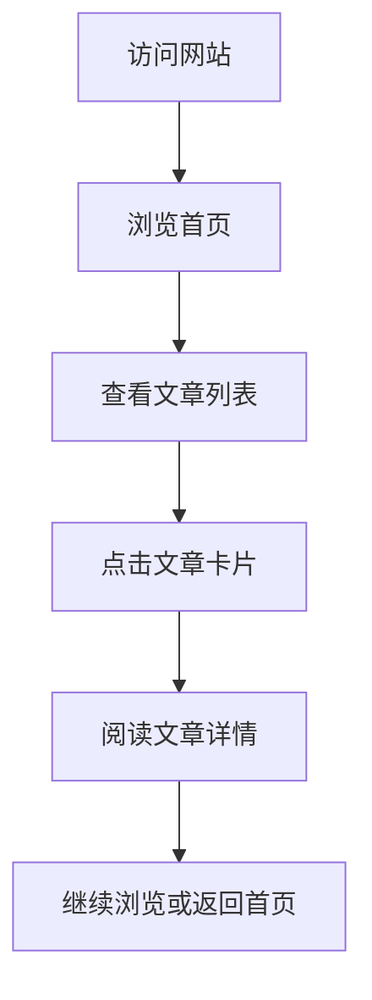

## 1. Product Overview
JokerHou Site是一个个人博客网站，旨在展示文章内容并提供卓越的视觉体验和用户交互。目标是打造一个现代、美观、有设计感的博客界面。
- 为访客提供视觉震撼的内容展示平台
- 通过精心设计的排版和动画效果提升用户体验

## 2. Core Features

### 2.1 Feature Module
1. **首页/博客列表页**: 英雄区域、导航栏、文章卡片列表
2. **文章详情页**: 文章内容展示、阅读时间、作者信息

### 2.3 Page Details
| Page Name | Module Name | Feature description |
|-----------|-------------|---------------------|
| 首页/博客列表 | 英雄区域 | 动态背景、渐变色文字、浮动动画效果 |
| 首页/博客列表 | 导航栏 | 固定顶部、悬停效果、平滑滚动、响应式设计 |
| 首页/博客列表 | 文章卡片列表 | 卡片悬停动画、渐入效果、错落有致的网格布局 |
| 文章详情页 | 文章内容 | 优雅的排版、突出的标题、平滑的阅读体验 |
| 文章详情页 | 页脚 | 深色背景、社交媒体链接、版权信息 |

## 3. Core Process
用户访问网站 → 浏览首页英雄区域和文章列表 → 点击感兴趣的文章 → 阅读文章详情 → 浏览其他文章或通过导航访问其他页面

## 4. User Interface Design
### 4.1 Design Style
- **主色调**: 紫色到蓝色渐变 (#8B5CF6 → #3B82F6)，辅以深灰色背景 (#0F172A)
- **辅助色**: 橙红色 (#F43F5E) 用于强调和交互元素
- **按钮风格**: 圆角矩形、渐变背景、悬停时轻微放大和发光效果
- **字体**: 标题使用 'Playfair Display' 或类似优雅字体，正文使用 'Inter' 或类似现代无衬线字体
- **布局风格**: 卡片式网格布局，打破传统的对称设计，加入适当的重叠和错位
- **动画效果**: 页面加载时的渐入动画、滚动时的视差效果、卡片悬停时的上浮和阴影加深

### 4.2 Page Design Overview
| Page Name | Module Name | UI Elements |
|-----------|-------------|-------------|
| 首页/博客列表 | 英雄区域 | 全屏高度、动态渐变背景、浮动装饰元素、大号标题、副标题、CTA按钮 |
| 首页/博客列表 | 导航栏 | 固定在顶部、半透明背景、Logo、导航链接、GitHub链接 |
| 首页/博客列表 | 文章卡片 | 不同尺寸的卡片、悬停效果、文章预览图、标题、摘要、发布日期 |
| 文章详情页 | 文章内容 | 宽边距、优雅的排版、代码高亮、图片展示 |
| 通用 | 页脚 | 深色背景、三栏布局、社交媒体图标、版权信息 |

### 4.3 Responsiveness
- **桌面优先设计**，同时完美适配平板和移动设备
- 在移动设备上调整为单列布局，简化导航
- 触摸优化的交互元素大小和间距

### 4.4 Special Effects
- **背景**: 使用渐变网格和动态粒子效果
- **动画**: 页面元素的 staggered 入场动画
- **视觉层次**: 通过卡片阴影、z-index 层级和重叠创造深度感
