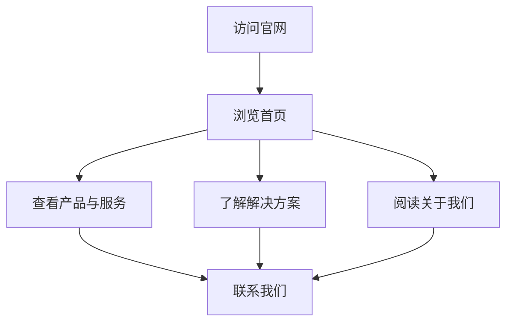

# 签梦云（济南）信息科技有限公司官网 - 产品需求文档

## 1. Product Overview
签梦云（济南）信息科技有限公司是一家专注于工业互联网的高科技企业，官网旨在展示公司形象、产品服务、解决方案和企业文化。
- 目标用户：制造业企业、工业客户、合作伙伴、求职者
- 目标价值：建立专业可信的企业形象，展示技术实力，促进业务对接

## 2. Core Features

### 2.2 Feature Module
1. **首页**：英雄区域、导航栏、产品展示、核心优势、客户案例、联系入口
2. **产品与服务**：产品介绍、功能亮点、技术优势、服务体系
3. **解决方案**：行业解决方案、成功案例、客户故事
4. **关于我们**：公司简介、发展历程、企业文化、团队介绍
5. **新闻中心**：公司新闻、行业动态、媒体报道
6. **联系我们**：联系方式、在线咨询、地图导航

### 2.3 Page Details
| Page Name | Module Name | Feature description |
|-----------|-------------|---------------------|
| 首页 | Hero区域 | 全屏背景，动态工业元素动画，标语展示，CTA按钮 |
| 首页 | 产品展示区 | 产品卡片网格，悬停效果，产品预览 |
| 首页 | 核心优势 | 图标+文字的优势展示，动态入场效果 |
| 首页 | 客户案例 | 案例轮播或网格，案例预览 |
| 产品与服务 | 产品列表 | 产品分类展示，产品详情入口 |
| 产品与服务 | 功能介绍 | 产品功能详解，技术规格 |
| 解决方案 | 行业方案 | 行业分类，方案详情展示 |
| 关于我们 | 公司介绍 | 发展历程时间线，企业文化展示 |
| 新闻中心 | 新闻列表 | 新闻卡片，分类筛选，详情页 |
| 联系我们 | 联系方式 | 地址、电话、邮箱，在线咨询表单 |

## 3. Core Process
访问者进入官网 → 浏览首页了解公司 → 查看产品服务或解决方案 → 阅读新闻了解动态 → 通过联系页面建立业务联系

## 4. User Interface Design
### 4.1 Design Style
- **主色调**：科技蓝 (#0066CC) + 工业灰 (#333333) + 创新绿 (#00CC66)
- **辅助色**：白色、浅灰、深色渐变
- **按钮风格**：圆角矩形，渐变色填充，悬停时有轻微上浮和发光效果
- **字体**：标题使用思源黑体 Bold，正文使用思源黑体 Regular
- **布局风格**：模块化卡片式布局，清晰的信息层级
- **视觉风格**：科技感、专业性、工业元素结合的现代设计

### 4.2 Page Design Overview
| Page Name | Module Name | UI Elements |
|-----------|-------------|-------------|
| 首页 | Hero区域 | 工业元素动态背景，公司全称展示，标语："连接工业，智造未来"，CTA按钮："了解产品"、"联系我们" |
| 首页 | 产品展示区 | 卡片式布局，产品图标，产品名称，简短描述，悬停时有缩放和阴影效果 |
| 首页 | 核心优势 | 图标+文字组合，动态入场动画，4-6个核心优势点 |
| 首页 | 客户案例 | 案例轮播或网格，案例logo和名称，点击查看详情 |
| 产品与服务 | 产品列表 | 产品分类标签，产品卡片，产品图片/视频，功能亮点 |
| 解决方案 | 行业方案 | 行业图标，方案描述，案例链接 |
| 关于我们 | 公司介绍 | 时间线展示发展历程，团队照片，企业文化标语 |
| 联系我们 | 联系方式 | 地图嵌入，联系信息卡片，在线咨询表单 |

### 4.3 Responsiveness
- **桌面端优先**：1200px以上完美展示
- **平板适配**：768px-1200px响应式调整
- **移动端优化**：768px以下单列布局，简化导航，触摸友好

### 4.4 Special Effects
- **背景**：工业科技风格的渐变背景，微妙的网格纹理
- **动画**：页面元素的交错入场动画，悬停时的微妙动效，滚动触发的视差效果
- **视觉层次**：通过阴影、透明度和空间关系创造深度感
